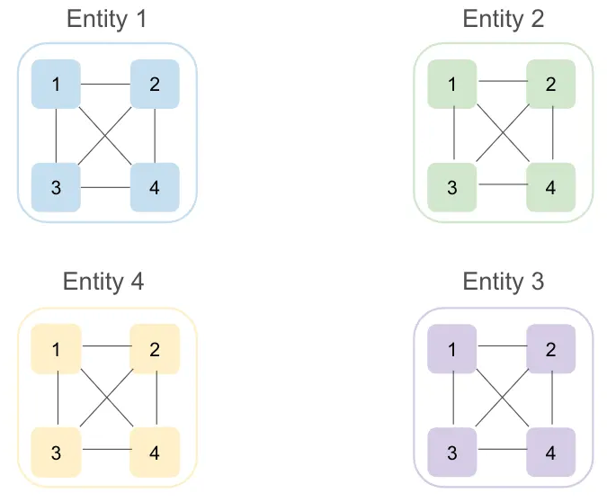
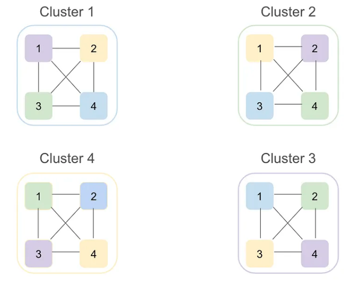
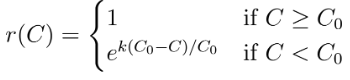
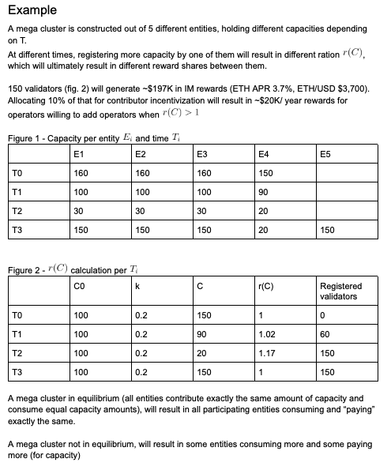
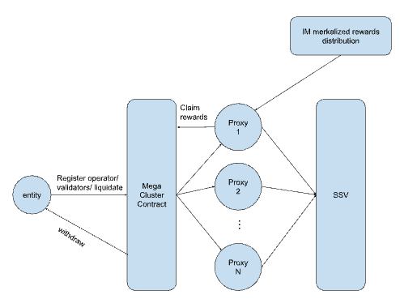

# Mega-Clusters
Many of the validators on the beacon chain are run by professional node operators. Many of them operate as part of big LST/LRT protocols, creating business and technical ties that can potentially create correlated vulnerabilities.

There is a natural tendency for bigger node operators to run All-in-one or Many-by-one clusters as shown in the diagram below.
Mega clusters are a way to transition all-in-one/ many-by-one cluster setups to be many-by-many or even completely permissionless, further decentralizing big node operator without compromising their requirements, revenue and regulatory constraints.


From this (centralized)             |  To this (decentralized)
:-------------------------:|:-------------------------:
  |  


[Mega clusters](https://medium.com/@alonmuroch-65570/dvt-mega-clusters-21b2e73fe934) are the re-allocation of nodes by an entity to other entities as part of a multi (mega) cluster setup. Done as part of a group, the end result is the formation of many-by-many clusters to be used by each participating entity.

## Practical Mega-Clusters (what this repo is about)
For mega clusters to be practical they need to have the following properties:
* **Dynamic capacity** - enable dynamic capacity, allowing very large stakers with smaller ones supporting one another
* **Autonomous** - stakers can register and remove validators as they see fit
* **Controllable** - a “mega cluster” should allow whitelisting specific entities

### Capacity
A mega cluster's capacity is the number of new validators it can accommodate across 4 operators from 4 different entities.

To encourage entities (participating in the mega cluster) to add more operators, we introduce an economical incentivization layer.
When entities register validators using the mega cluster they commit to setting aside some X% of the incentivized mainnet rewards those validators generate, for example 10%. 
The $SSV rewards set aside for the mega cluster are called its treasury.

When capacity runs low, for example under some defined C0 (example 1,000 validators), the mega cluster contracts can encourage entities to register more operators to increase capacity above C0.
When an entity (participating in the mega cluster) registers a new operator, it recieves a special token representing its share of the treasury. The more operators it registers the more of those tokens it gets.

The amount of tokens changes depending on some rate r(C):



As a role of thumb, entities adding capacity when it's below C0 will get more tokens (representing higher share in the treasury).
**_At this point we've created economical incentives to maintain the mega-cluster with some minimum capacity!_** 

### Example


## Mega-Cluster contracts
The mega cluster contracts is built as a wrapper to the SSV contracts, managing the different entities, rewards, etc.

Each entity will have its own "EntityProxy.sol" contract that will isolate its validator control AND IM rewards from the other entities 



### Running
```shell
npm run test 
```

[gas report](./gas_report.md)